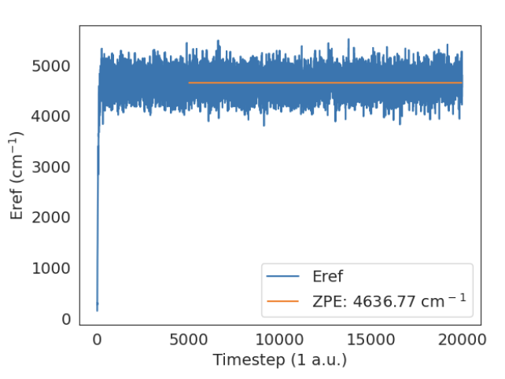
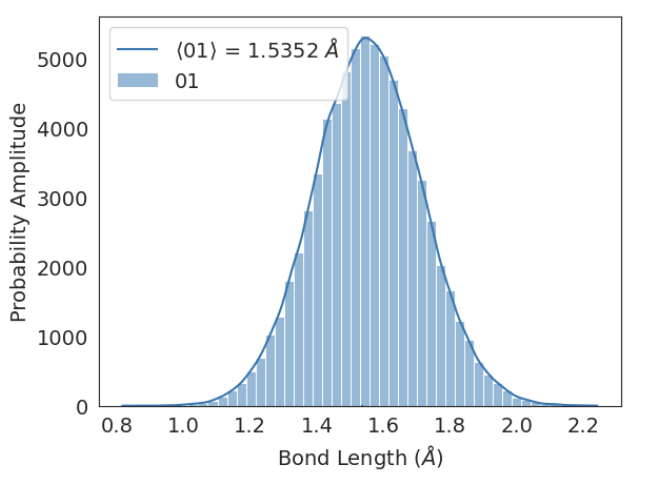
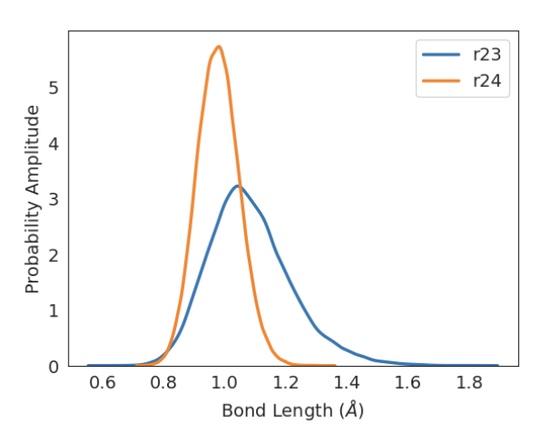
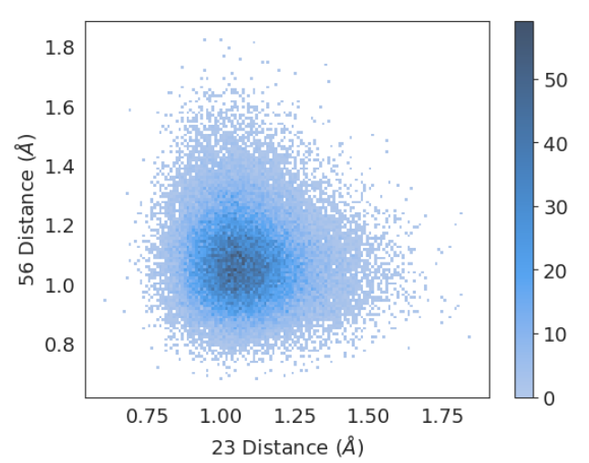

**Notes**  
PyVisDMC requires Python 3.8 or above.
Dependencies: h5py, matplotlib, numpy, pandas, pyvibdmc, PyYAML, seaborn

---

This program was created at the University of Washington in fall 2024 as a final project for the course Software Development for Data Scientists (CSE 583). Team members on this project are acknowledged for their contributions below:

* Greta Jacobson - chemical intuition and knowledge of PyVibDMC package, development of data loader and plotting functions, along with their corresponding test functions. 
* Lauren Dressler - development of config.yml as the "user interface"--wrote main script and corresponding test functions, wrote README documentation
* Ramses Llobet - initial plotting exploration, checked and revised this codebase to meet style and documentation standards

---

**PyVisDMC** is a Python-based visualization tool designed to read simulation data produced by [**PyVibDMC**](https://pyvibdmc.readthedocs.io/en/latest/) and generate a variety of informative plots relevant for data analysis. We hope PyVisDMC can be a useful tool for students, researchers, and anyone needing to quickly visualize simulation outputs without writing extensive plotting code.

# **Features**

### - Integration with PyVibDMC:  
  Reads `.hdf5` files generated by PyVibDMC to produce various plots without code recompilation.  
### - Plot Selection via Configuration File:  
  Specify the plot types (e.g., `eref`, `one_dist`) directly in a YAML config file rather than modifying code.  
### - Set of Built-In Plot Types:  
  * **eref**: Average ensemble energy over time, including calculation of the zero-point energy (ZPE) over specified start/stop points.

    
  
  * **one_dist**: Probability distribution of a single bond length.

    
    
  * **mult_dist**: Probability distributions of multiple bond lengths simultaneously.
      
    
    
  * **two_d_dist**: A 2D probability distribution plot comparing two different bond lengths.

    
    
    
### - Command-Line Usability:  
  * Run `pyvisdmc config.yaml` from the command line to generate all requested plots at once  
  * Quickly switch between different simulation data by editing the config.yml file  
  * No need to re-compile any code for new datasets  
### - PNG Output Format:  
  * Plots saved as a PNG by default   
### - Built-In Logging:  
  * Automatically includes simulation parameters (number of walkers, timesteps, etc.) in plot annotations and PNG names  
  * Easily trace which plots correspond to which PyVibDMC runs  
### - Adaptable:  
  * Users can add custom plot functions with minimal code changes
  * See the section [**Adding Your Own Plotting Functions**](https://github.com/gretaja/pyvisdmc/tree/main?tab=readme-ov-file#adding-your-own-plotting-functions) below

---
# **Installation**

To install the most recent version of PyVisDMC, simply run the following from the command line: 

```bash
pip install git+https://github.com/gretaja/pyvisdmc.git
```
---

# **Usage**

1. **Generate Data Using PyVibDMC**:  
   PyVibDMC produces the `.hdf5` file(s) to be analyzed.  
2. **Edit `config.yml` with your desired inputs**:  
   A full list of required and optional keys are specified below, in the section [**Writing a Valid `config.yml`**](https://github.com/gretaja/pyvisdmc/tree/main?tab=readme-ov-file#writing-a-valid-configyaml).
3. **Run PyVisDMC in the command line**:  
```bash   
pyvisdmc config.yaml
```
4. PyVisDMC will find the desired PyVibDMC output file, create the requested plots, and save them in the current directory.

---

# **Writing a Valid `config.yaml`**

Your `config.yaml` file must contain the following required keys:

* **`data_path`**: Path to the folder containing the PyVibDMC simulation data on your computer.  
* **`molecule`**: The name of the molecule simulated (e.g., `h2o`, `h5o3`).  
* **`sim_num`**: The simulation number as saved in the data folder  
* **`walkers`**: The number of walkers that were used in the PyVibDMC simulation.  
* **`timesteps`**: The total number of timesteps simulated.  
* **`start`** and **stop**: The range of timesteps for analysis and plotting. Ensure `start < stop` and both are within the total timesteps.  
* **`plots`**: A list of plots to generate. Built-ins: `eref`, `one_dist`, `mult_dist`, `two_d_dist`.

For certain plots, additional arguments are required:

* **`one_dist`** requires `dist: [i,j]` specifying the two atom indices for the bond length to measure.  
* **`mult_dist`** requires `mult_dists: [[i1,j1],[i2,j2],...]` specifying multiple pairs of atom indices.  
* **`two_d_dist`** requires `2d_dists: [[i1,j1],[i2,j2]]` specifying two sets of atom indices for the 2D distribution.

### **Example Configuration File**

```yaml
# this generates plots with sample data from this repo
data_path: src/pyvisdmc/test_data
molecule: h5o3
sim_num: 0
walkers: 5000
timesteps: 20000
start: 10000
stop: 20000

plots:
  - eref
  - one_dist
  - mult_dist
  - two_d_dist

dist: [0,1]
mult_dists: [[2,3],[2,4],[2,0]]
2d_dists: [[2,3],[5,6]]
```
---

# **How to Contribute**

**Fork the PyVisDMC Repository** on GitHub:

```bash
git clone git@github.com:yourGitHubUsername/pyvisdmc.git # creates forked repository 
git remote add upstream git@github.com:gretaja/pyvisdmc.git # address of original repository  
git remote -v # runs a check
```

**Stay Updated**:

To remain up to date with the latest changes to PyVisDMC, run the following:

```bash  
git fetch upstream 
git merge upstream/master
```

If the merge is successful, run `git push` to update your forked repository.

**Open a Pull Request** on GitHub if you’d like your changes to be included in the main PyVisDMC repository.

---

# **Adding Your Own Plotting Functions**

If you have a unique visualization need, you can add your own plotting functions by following the steps below.

1. **Create a New Plotting Function**:  
* Inside `src/pyvisdmc/plots/`, create a new Python file called your-plot-name.py. For example, if you want to add plotting code called `custom_plot`, you'd add the following file

```python   
# in src/pyvisdmc/plots/custom_plot.py
import matplotlib.pyplot as plt
import seaborn as sns
# etc...

def plot_custom(data_path,...):
  # implement your plot logic here

  plt.title(f"Custom Plot for {molecule}, sim {sim_num}")
  plt.savefig(f"{molecule}_sim_{sim_num}_custom_plot.png")
  plt.clf()
```

2. **Register Your Plot in `main.py`**:
* Import your new plotting function in `main.py` by adding:  
 
```python
from pyvisdmc.plots.custom_plot import plot_custom
```

   * Decide on a plot name (e.g., `custom`) and add a condition to handle it in `main.py`:  
```python
if 'custom' in plots:
  plot_custom(data_path,...)
  print(f"custom plot saved as {molecule}_sim_{sim_num}_custom_plot.png")
  print("")
```

   * Add any required arguments to your `config.yaml` and retrieve them in `main.py` if needed. For example, if `custom` needs a parameter `my_param`, your `config.yml` needs to contain:
```yaml
my_param: input
```
   * If you have additional parameters, your condition in `main.py` should contain:
```python  
my_param = config.get('my_param')
```
---

